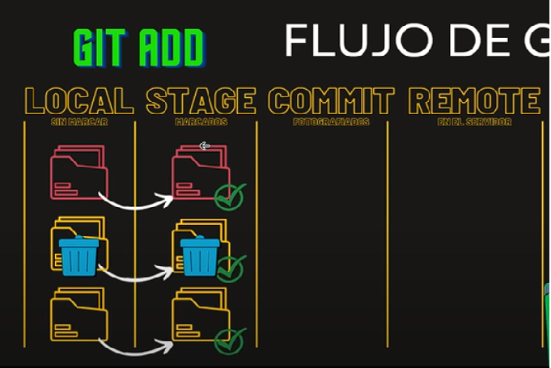
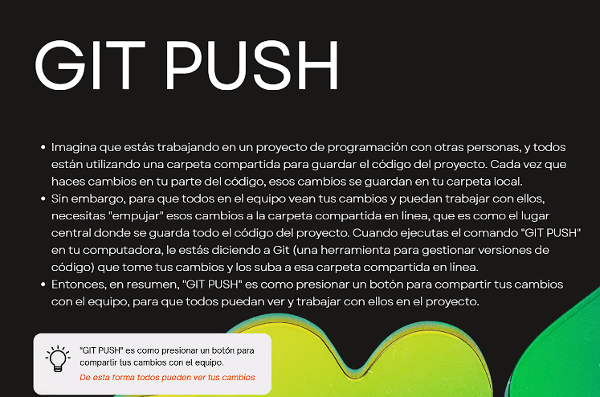
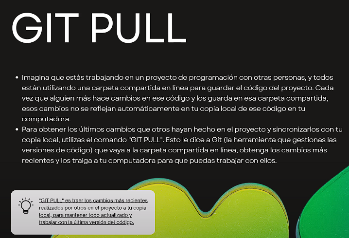

# Instalaciones necesarias para curso GIT & GITHUB

 - [GOOGLE CHROME (NAVEGADOR)](https://www.google.com/intl/es_es/chrome/)
 - [VISUAL STUDIO CODE (Editor Código)](https://code.visualstudio.com/download)
 - [GIT (manejador de versiones)](https://git-scm.com/)

# Instalaciones opcionales relacionadas
 - [Github Desktop](https://desktop.github.com/)
 - [Git Kraken Client](https://www.gitkraken.com/)
 
# Documentaciones oficiales:
 - [GIT DOCUMENTATION](https://git-scm.com/doc)
 - [GITHUB DOCS ESPAÑOL](https://docs.github.com/es)

## CANAL DE YOUTUBE:
[CANAL SERGIE CODE](https://www.youtube.com/@sergiecode)

# Que es Git?
  
en tu computadora podes crear tu version, luego subirla y sincronizarla

Podemos tener un historial donde podemos ver donde se agregaron o sacaron cambios, y se pueden hacer rollback

# Que es GitHub
  Es una paltaforma en linea que utiliza el sistema de control de versiones Git que aloja el codigo fuente y facilitar la colaboracion

# Nos puede ayudar en ...
 Cuando empezo a fallar nuestra app, podemos detectar eso leyendo el historia de commits, y podemos hacer rollback

# Seccion 03 - GIT CONFIG

- git config --global user.name "Guillermo Lescano"

- git config --global user.email guillelescano.gl@gmail.com

  - En este caso debemos usar el mail que tenemos en el repositorio

<!--Aca configuramos el editor csCode-->
- git config --global core.editor "code --wait"

<!--para comprobarlo usamos este comando-->
- git config --global -e 
  - Comprobamos que se abra en vsCode 

- git config --global core.autocrlf true  <!--Si es windows true-->
- git config --global core.autocrlf input <!--Si es linux o mac input-->

# Seccion 04 - Comando basicos de la terminal

<!--Vemos el listado de carpetas-->
- ls
<!--change directory , nos cambiamos de directorio-->
- cd nombreCarpeta
<!--Saber el directorio donde estamos parados-->
- pwd
<!--para volver una carpeta-->
- cd .. 
<!--Para crear directorios(carpetas-->
- mkdir nombreCarpeta 
<!--para viajar varias rutas a carpeta2-->
- cd ./carpeta1/carpeta2
<!--para ver archivos ocultos-->
- ls -a 
<!---->
- git 
<!---->
- git 
<!---->
- git 

# Seccion 05 - Flujo de GIT
 Vamos a ver el flujo de git, como nuestro archivos pasan de estado en estado hasta llegar al estado remoto que es el estado final

Aqui al comienzo tenemos nuestro estado local con 3 archivos, que debemos inicializar con 
  - git init

esto no hace nada con los archivos hasta que no hacemos git add
  
  - git add

aqui es cuando pasa al estado stage y git ya los detecta

  - git status

consultamos el estado de los archivos que tenemos en stage

  - git commit

si hacemos un git commit vamos a fotografiar el estado de commit y nos hace un historial  

una vez que queremos que este commit vaya al servidor externo(repo) ne este caso github

Para poder sacar un archvio del stage una vez haber hecho git add podemos hacer 

 - git rm --cached file2.txt

y luego esta el 
  - git push

# Seccion 06 - Git init, add ,status ,commit
Parte mas practica de esto

Creamos una carpeta
 - mkdir proyecto-git

Nos posicionamos dentro de ella
 - cd proyecto-git

Inicializamos el repo
 - git init

Abrimos el vsc
 - code .

creamos un archivo txt dentro del visual studio code

y luego consultamos el estado del repo
 - git status

el archivo file1.txt no esta trackeado para pasarlo a la estapa de stage
 - git add file1.txt

si ponemos nuevamente git sttaus nos muestra que ya esta listo para commitear

podemos crear tranquilamente un un file2.txt y si ponemos git status, nos muestra que esta uno trackeado y el otro sin trackear (file 2)

si ponemos 
 - git add File2.txt

esto nos trackea los dos archivos para poder ser commiteados

si por ejemplo modificamos alguno de estos dos archivos los modificamos y ponemos git status nuevamente, nos dice que estan los dos archivos para ser commiteados pero nos dice que el arhcivo modificado tiene cambios y nos dice que hagamos otro git add para actualizarlo o git restore para volver para atras los cambios
 - git restore nombreArchivo ( esto elimina los cambios )

ahora vamos a commitear (fotografiar lo que tenemos en el stage )
 - git commit -m 'nombre del commit'

 Aca una vez que tengamos commiteado todo, podemos modificar un arhcivo, el readme en este caso, guardamos y podemos consultar con git status nuevamente

 Lo que nos aparece que es hay una rchivo modificado y que debemos subirlo si queremos tener todo actualizarlo

 hacemos el git add y commiteamos

# Seccion 7 - Git .IGNORE

Es un archivo de configuracion donde ponemos todos los archivos y carpetas que van a ser ignorados por git, y que no van a ser fotografiados ni subidos, creamos el archivo .gitignore en vsc
 - .gitignore

una vez creado el archivo, los archivos que no solemos querer que se suban por ejemplo

 - .env suelen tener pass contraseñas, no queremos que eso se suba al git
 - node_modules

podemos usar comodines por ejemplo si no queremos subir imagenes

 - .jpg

# Seccion 08 - Git Diff

Esto nos muestra la diferencia de antes y despues de un archivo

Otra forma de usar el git status es poniendo
 - git status -s

Esto nos muestra los archivos con una M en rojo si este fue modificado, si es una archivo creado aparecen signos de interrogacion
Una vez que hacemos el git add , y consultamos el nuevo stado, nos dice que esta en M verde modificado agregado, y el creado con una A ver de Add

 - git diff

# Seccion 09 - Git Log

Aca vemos como visualizar los commit's 
 - git log 
 - git log --oneline

Recordamos que los commit son como fotografias uno atras de otro y el oneline nos muestra el hash y el nombre de los commit que hicimos

# Seccion 10 - Ramas/branch git branch, checkout

Esto nos dice en que rama estamos parados
  - git branch

Para poder irnos a otra rama es
  - git checkout NombreRama

Y si nos queremos ir a una rama y la creamos ahi es
  - git checkout -b NombreRama

Si hacemos cambio y luego commiteamos, estamos haciendo el commit en esta rama, la otra rama queda desactualizada. 
Si nosotros queremos unir estos cambios a master, tenemos que irnos a master y hacer un merge de la rama nueva dentro de master
 - git merge RamaNueva

Se realiza los cambios el cual vamos a traer la rama nueva dentro de master sin problemas

# Seccion 11 - Creacion de repo remoto

Debemos ir a gitHub y sguit unos pasos
 - New Repository

Luego colocamos el nombre del repo y ponemos
 - Create Repository

Luego de eso nos va a salir una serie de comando a seguir, que son
 - git init
 - git add . / git add file1.txt
 - git commit -m 'nombre del commit'
 - git branch -M main ( Aca creamos una rama llamada main y nos vamos a ella)
 - git remote add origin https://github.com/Guillermo-Lescano/proyecto-curso-git.git (esto nos sale en los paso a seguir)
 - git push -u origin main (en mi caso es master, main es porque hicimos la rama main arriba)

Cuando alguien esta trabajando en otra rama, o subimos un archivo desde gitHub y necesitamos actualizar nuestro repo local, tenemos para hacer el git pull
- git pull

Esto nos trae los cambios desde el repo a nuestra rama local

# Seccion 12 - Git pull y Git push

En resumen el git push es compartir tus cambios en gitHub que es una carpeta remota y ahi tus compañeros de proyecto puedan vizualizar tus cambios

En este caso el git pull es traer los cambios mas recientes del repo y traerlos a tu carpeta local

 - git branch -u origin/master ==> seteamos la rama que queremos subir

# Seccion 13 - Git Tag y Switch

Git tag es un comando donde nos permite etiquetar uno de los commit como un commit importante
 - git tag nombreTag

El git switch el verdadero comando que usa vsc cuando cambia de ramas, checkout trae la rama si no la tememos local o creamos una nueva, y el switch es para realmente cambiar de rama de forma local 
 - git switch nombreDeRama

El git checkout nos deja viajar por commit tambien, cosa que el switch no nos deja
 - git checkout 00b14b3 (es el numero del commit)

con el switch no nos deja, tambien otra cosa que nos deja hacer el checkout es viajar por commit y tambien en etiquetas creadas con el git tag
 - git checkout nombreEtiqueta

# Seccion 14 - Git stash y stash pop

Es como un commit temporal el git stash que guarda los cambios que no tenemos commiteados y lo guarda, esto por ejemplo cambiarnos de rama y tenemos algo sin resolver aun, y no podemos commitear porque tiene un error, entonces lo que sucede es que stasheamos esto sin guardar aun, y cuando volvemos a la rama volvemos a utilizar estos datos

 - git stash
 - git stash list 

Esto nos muestra los stash que tenemos

para poder recuperar el stash que quedo en WIP necesitamos poner
 - git stash pop

y nos trae los cambios en los que estabamos

# Seccion 14 - Eliminar ramas

Podemos eliminar ramas de forma local y de forma remota para poder hacermo necesitamos
 - git branch -d nombreRama 

Esto lo elimina de forma local, en el repo remoto va a seguir estando ahi, esto quiere decir que podemos irnos a la rama que eliminamos ya que sigue remotamente activa

Si la quiero borrar de forma definitiva debemos hacer lo mismo que recien que borramos localmente, pero ahora agreamos
 - git branch -d nombreRama 
 - git push origin --delete nombreRama

con estos dos comandos borramos la rama localmente y de forma remota, asi que ya se borro en el repositorio tambien.

# Seccion 15 - Git fetch

A diferencia del git pull, solo trae el historia de cambio que se hicieron de forma remota
 -git fetch

Para poder ver lo que trae el git fetch necesitamos poner este comando de git
 - git log --oneline --all

Nos permite ver todas las modificaciones que se hicieron de forma remota (esto necesitamos hacerlo despues del git fetch), despues de que vimos lo que se cambio, podemos hacer un git pull, casi nunca se usa, porque podemos verlo desde el repo, o lo traemos directamente como el pull, pero siempre es bueno saberlo.
 - git tree se usa solo en mc y nos trae todo un arbol con la info

# Seccion 16 - Git reset / --hard

