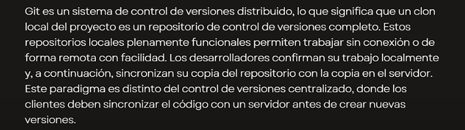
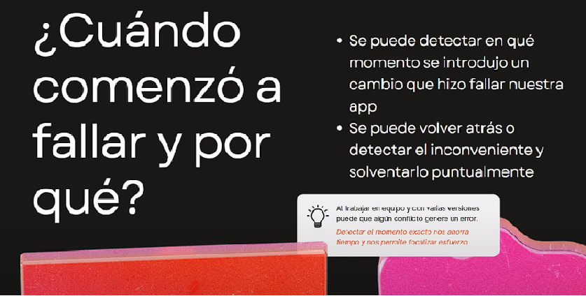
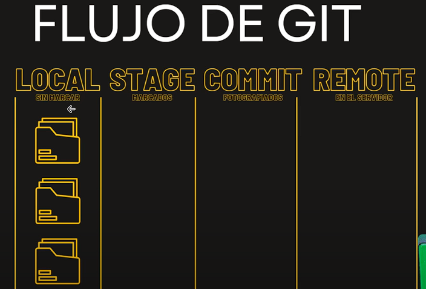
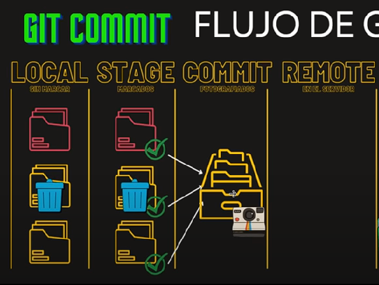

# Instalaciones necesarias para curso GIT & GITHUB

 - [GOOGLE CHROME (NAVEGADOR)](https://www.google.com/intl/es_es/chrome/)
 - [VISUAL STUDIO CODE (Editor Código)](https://code.visualstudio.com/download)
 - [GIT (manejador de versiones)](https://git-scm.com/)

# Instalaciones opcionales relacionadas
 - [Github Desktop](https://desktop.github.com/)
 - [Git Kraken Client](https://www.gitkraken.com/)
 
# Documentaciones oficiales:
 - [GIT DOCUMENTATION](https://git-scm.com/doc)
 - [GITHUB DOCS ESPAÑOL](https://docs.github.com/es)

## CANAL DE YOUTUBE:
[CANAL SERGIE CODE](https://www.youtube.com/@sergiecode)

# Que es Git?
  
en tu computadora podes crear tu version, luego subirla y sincronizarla

Podemos tener un historial donde podemos ver donde se agregaron o sacaron cambios, y se pueden hacer rollback

# Que es GitHub
  Es una paltaforma en linea que utiliza el sistema de control de versiones Git que aloja el codigo fuente y facilitar la colaboracion

# Nos puede ayudar en ...
 Cuando empezo a fallar nuestra app, podemos detectar eso leyendo el historia de commits, y podemos hacer rollback

# Seccion 03 GIT CONFIG

- git config --global user.name "Guillermo Lescano"

- git config --global user.email guillelescano.gl@gmail.com

  - En este caso debemos usar el mail que tenemos en el repositorio

<!--Aca configuramos el editor csCode-->
- git config --global core.editor "code --wait"

<!--para comprobarlo usamos este comando-->
- git config --global -e 
  - Comprobamos que se abra en vsCode 

- git config --global core.autocrlf true  <!--Si es windows true-->
- git config --global core.autocrlf input <!--Si es linux o mac input-->

# Seccion 04 Comando basicos de la terminal

<!--Vemos el listado de carpetas-->
- ls
<!--change directory , nos cambiamos de directorio-->
- cd nombreCarpeta
<!--Saber el directorio donde estamos parados-->
- pwd
<!--para volver una carpeta-->
- cd .. 
<!--Para crear directorios(carpetas-->
- mkdir nombreCarpeta 
<!--para viajar varias rutas a carpeta2-->
- cd ./carpeta1/carpeta2
<!--para ver archivos ocultos-->
- ls -a 
<!---->
- git 
<!---->
- git 
<!---->
- git 

# Seccion 05 Flujo de GIT
 Vamos a ver el flujo de git, como nuestro archivos pasan de estado en estado hasta llegar al estado remoto que es el estado final

Aqui al comienzo tenemos nuestro estado local con 3 archivos, que debemos inicializar con 
  - git init

esto no hace nada con los archivos hasta que no hacemos git add
  
  - git add

aqui es cuando pasa al estado stage y git ya los detecta

  - git status

consultamos el estado de los archivos que tenemos en stage

  - git commit

si hacemos un git commit vamos a fotografiar el estado de commit y nos hace un historial  

una vez que queremos que este commit vaya al servidor externo(repo) ne este caso github

Para poder sacar un archvio del stage una vez haber hecho git add podemos hacer 

 - git rm --cached file2.txt

y luego esta el 
  - git push

Parte mas practica de esto

Creamos una carpeta
 - mkdir proyecto-git

Nos posicionamos dentro de ella
 - cd proyecto-git

Inicializamos el repo
 - git init

Abrimos el vsc
 - code .

creamos un archivo txt dentro del visual studio code

y luego consultamos el estado del repo
 - git status

el archivo file1.txt no esta trackeado para pasarlo a la estapa de stage
 - git add file1.txt

si ponemos nuevamente git sttaus nos muestra que ya esta listo para commitear

podemos crear tranquilamente un un file2.txt y si ponemos git status, nos muestra que esta uno trackeado y el otro sin trackear (file 2)

si ponemos 
 - git add File2.txt

esto nos trackea los dos archivos para poder ser commiteados

si por ejemplo modificamos alguno de estos dos archivos los modificamos y ponemos git status nuevamente, nos dice que estan los dos archivos para ser commiteados pero nos dice que el arhcivo modificado tiene cambios y nos dice que hagamos otro git add para actualizarlo o git restore para volver para atras los cambios
 - git restore nombreArchivo ( esto elimina los cambios )

ahora vamos a commitear (fotografiar lo que tenemos en el stage )
 - git commit -m 'nombre del commit'

 Aca una vez que tengamos commiteado todo, podemos modificar un arhcivo, el readme en este caso, guardamos y podemos consultar con git status nuevamente

 Lo que nos aparece que es hay una rchivo modificado y que debemos subirlo si queremos tener todo actualizarlo